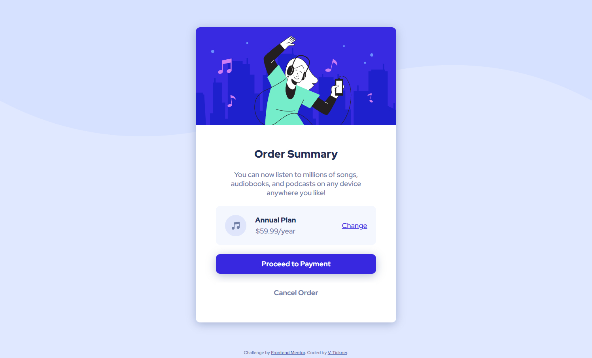
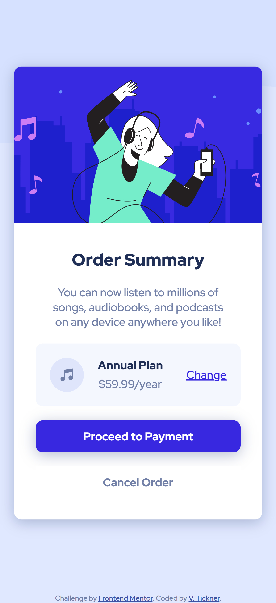

# Frontend Mentor - Order summary card solution

This is a solution to the [Order summary card challenge on Frontend Mentor](https://www.frontendmentor.io/challenges/order-summary-component-QlPmajDUj).

## Table of contents

- [Overview](#overview)
  - [Screenshots](#screenshots)
  - [Links](#links)
- [My process](#my-process)
  - [Built with](#built-with)
  - [What I learned](#what-i-learned)
  - [Continued development](#continued-development)
  - [Useful resources](#useful-resources)
- [Author](#author)

## Overview

The challenge was to build a responsive layout to show an order summary card component and get the design to look as close as possible to the provided design images. It also included using a hover state for the buttons and link.

### Screenshots

### Links

- Solution URL: [https://github.com/VTickner/frontend-mentor-order-summary-card-component](https://github.com/VTickner/frontend-mentor-order-summary-card-component)
- Live Site URL: [https://vtickner.github.io/frontend-mentor-order-summary-card-component/](https://vtickner.github.io/frontend-mentor-order-summary-card-component/)

## My process

- Created semantic HTML first
- Created CSS selectors to:
  - create custom variables to contain the various colours, font sizes font weights used in the design
  - used a CSS reset
  - layout the design using Flexbox
  - style the various elements, adding in hover states for the buttons and link
  - added in `:focus` styling for accessibility purposes
  - create a different width layout for mobile version

### Built with

- Semantic HTML markup
- CSS custom properties
- Flexbox
- Desktop-first workflow (responsive design)
- Google Font

### What I learned

I didn't learn anything new on this project, but did gain some extra practice.

### Continued development

Gain extra practice on more complicated layout designs.

### Useful resources

- [Google Fonts](https://fonts.google.com/) - The fonts used in this design was [Red Hat Display](https://fonts.google.com/specimen/Red+Hat+Display) using Medium 500, Bold 700 and Black 900 font styles.

## Author

- Frontend Mentor - [@VTickner](https://www.frontendmentor.io/profile/VTickner)
